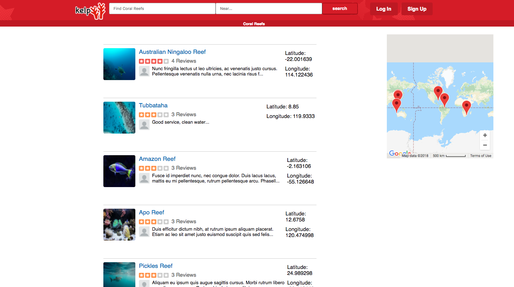
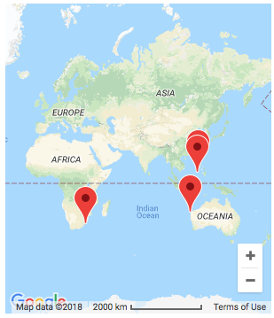

# Kelp README

Kelp is a full-stack, single-page web application clone of Yelp. It is a platform for users to share their experiences of coral reefs via reviews, ratings, and pictures. Along with these user-generated reviews, reefs are displayed on a show page with their relevant information to help provide a list of the best options available to users.



Visit Kelp here: https://kelp1.herokuapp.com/#/reefs


### Technologies
Kelp implements a Ruby/Rails backend with a Javascript/React-Redux frontend. Styling is done using CSS and HTML.


## Features
-  Reviews and Ratings
-  Google Maps API to display reef locations through markers
-  Auth components(Log in, Sign up, Guest Log in)
-  Search for Reefs

### Map Feature
-  Interactive Map that displays reef locations with markers
-  Clicking on markers redirects to the reef's show page



### Review Form
-  The review form accepts parameters for submitting a rating, review body, date, and photo. Because photos are their own table in the database schema, submitting a review with a photo required the Review model to accept nested parameters:

```
class Review < ApplicationRecord
  validates :body, :date, presence: true

  validates :rating, inclusion: { in: (1..5) }


  belongs_to :author,
    foreign_key: :author_id,
    class_name: "User"

  belongs_to :reef,
    foreign_key: :reef_id,
    class_name: "Reef"

  has_many :photos,
    foreign_key: :review_id,
    class_name: "Photo",
    inverse_of: :review

    accepts_nested_attributes_for :photos
end
```
-   Additionally, the Review Form must accept the nested photo attributes in addition to its own attributes on handling submit of the form:

```
class ReviewForm extends React.Component {
  constructor(props){
    super(props);
    this.state = {
      body: "",
      date: "",
      rating: "",
      imageUrl: "",
      imageFile: "",
      buttonColor: "#d90007"
    };
    this.handleSubmit = this.handleSubmit.bind(this);
    this.updateField = this.updateField.bind(this);
    this.updateFile = this.updateFile.bind(this);
    this.ratingStars = this.ratingStars.bind(this);
  }
```

```
handleSubmit(e) {
  e.preventDefault();
  const file = this.state.imageFile;
  const review = new FormData();
  const reefId = this.props.reef.id;
  review.append("review[photos_attributes][][image]", file);
  review.append("review[body]", this.state.body);
  review.append("review[rating]", this.state.rating);
  review.append("review[date]", this.state.date);
  review.append("review[reef_id]", reefId);
  review.append("review[author]", this.props.currentUser);
  this.props.createReview(review).then( () => this.props.history.push(`/reefs/${reefId}`));
}
```
## Future
-  Filtered search
-  Modals for logging in/signing up
-  Map markers that render reef details on hover
